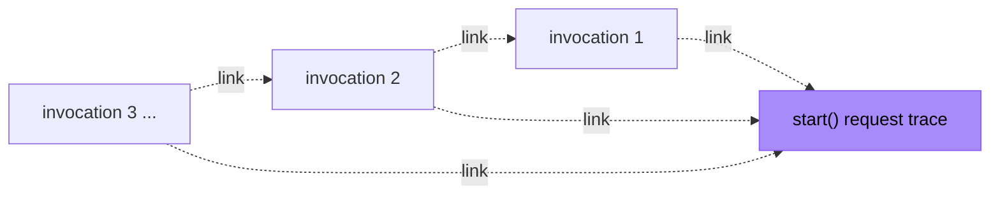

The Workflow SDK is instrumented with [OpenTelemetry](https://opentelemetry.io) out of the box. It emits spans for workflow starts, every workflow and step invocation, and the HTTP calls it makes to the workflow backend — and it propagates trace context across queue deliveries so a run remains traceable end to end.

The SDK only depends on the OpenTelemetry **API**, never on an SDK or exporter. If your application does not register an OpenTelemetry SDK, all tracing code is a silent no-op with no overhead and no behavior change.

## Enabling tracing

Register any OpenTelemetry Node SDK in your application. On Vercel with Next.js, the simplest setup is [`@vercel/otel`](https://vercel.com/docs/tracing/instrumentation) in `instrumentation.ts`:

```typescript title="instrumentation.ts" lineNumbers
import { registerOTel } from "@vercel/otel"

export function register() {
  registerOTel({ serviceName: "my-app" })
}
```

No workflow-specific configuration is required. As soon as a tracer provider and propagator are registered, the SDK's spans, context propagation, and span links activate automatically.

<Callout>
`@opentelemetry/api` is an **optional peer dependency**. An OpenTelemetry SDK such as `@vercel/otel` normally pulls it in transitively, but installing it directly (`npm i @opentelemetry/api`) guarantees it is present in your build — particularly for bundled or serverless targets where the SDK's tracing is inlined at build time. If it can't be resolved, tracing is a silent no-op.
</Callout>

## Spans

| Span name | Kind | Emitted when |
| --- | --- | --- |
| `workflow.start <name>` | internal | `start()` is called in your application code |
| `workflow.execute <name>` | consumer (root) | a queue delivery invokes the workflow — replay, orchestration, and inline steps run under it |
| `step.execute <name>` | internal (inline) / consumer + root (queue-delivered) | a step function executes |
| `http <method>` | client | the SDK calls the workflow backend (event reads/writes) |
| `workflow.stream.write` | client | a stream chunk (or the stream close) is flushed to the backend |
| `workflow.stream.flush` | client | a buffered batch of stream writes settles; back-dated to the batch's first `write()`, so its duration is the app-perceived batch latency (buffer dwell + RPC) |
| `workflow.stream.read.connect` | client | a live stream read opens; the span covers dispatch → response headers (network connect) |
| `workflow.stream.read` | client | a live stream read receives its first chunk; the span's duration is the end-to-end time-to-first-chunk (see `workflow.stream.read.ttfc_ms`) |

`<name>` is the short function name (for example `processOrder`); the full machine name, including the source module, is available in the `workflow.name` / `step.name` attributes.

Stream spans are emitted by the SDK's world backend on the client that writes or reads the stream, and (like all SDK spans) are no-ops when no OpenTelemetry SDK is registered. The `workflow.stream.read` span only appears once the first non-empty chunk arrives.

## Key attributes

| Attribute | Description |
| --- | --- |
| `workflow.run.id` | The run ID (`wrun_...`). Present on every workflow and step span — the primary key for finding all spans of a run. |
| `workflow.name` | The workflow function name. |
| `workflow.trace.mode` | The active trace mode (`linked` or `continuous`). |
| `workflow.trace.propagated` | Whether the invocation received trace context from the queue message. |
| `workflow.queue.overhead_ms` | Time between the message being enqueued and the handler starting — queue dwell plus any cold start. |
| `workflow.stream.name` | The stream name, on stream write/read spans. |
| `workflow.stream.operation` | The stream operation: `write`, `write_multi`, `close`, `read`, or `flush`. |
| `workflow.stream.write.chunk_rtt` | Time between emissions of a chunk to the wire, and receiving the `ack` message for that chunk. |
| `workflow.stream.flush.buffer_dwell_ms` | On `workflow.stream.flush`: time the batch's first chunk waited in the client-side write buffer (flush timer, run-ready barrier) before the request was dispatched. `workflow.stream.flush.chunks` / `.bytes` carry the batch shape. |
| `workflow.stream.read.ttfc_ms` | Time between opening a read connection and observing and receiving the first chunk back. |

## Trace shape: one trace per invocation

A single workflow run can span hours or days across many separate function invocations: every step completion, `sleep()` wake-up, and retry is a new queue delivery. Stitching all of that into one trace produces giant, slow-loading traces that most tracing backends truncate.

Instead, the SDK creates **one bounded trace per invocation**. Each `workflow.execute` (or background `step.execute`) span starts a new trace root and attaches two **span links**:

- a link to the **enqueue site** — the span that queued the message which triggered this invocation, and
- a link to the **run origin** — the trace in which `start()` was originally called.

A span link is OpenTelemetry's relationship for "causally related, but in a different trace." It is the standard pattern for asynchronous messaging, where producing and consuming a message can be separated by arbitrary time.



Each invocation links back to the trace that enqueued it and to the run origin.

To see a whole run, query by attribute rather than by trace ID — for example `workflow.run.id = wrun_...` in your tracing backend — or follow the span links between invocation traces.

## Trace modes

The `WORKFLOW_TRACE_MODE` environment variable controls the shape:

| Mode | Behavior |
| --- | --- |
| `linked` (default) | Each invocation is its own trace root with span links to the enqueue site and the run origin. Traces stay small; sampling is decided per invocation. |
| `continuous` | The run-origin context becomes the **parent** of every invocation, so the entire run shares one trace ID. |

<Callout type="warn">
This is a behavior change from v4, which always used `continuous`-style tracing. If you have dashboards or queries that assume one trace ID per run, either update them to use `workflow.run.id` and span links, or set `WORKFLOW_TRACE_MODE=continuous` to restore the previous shape. Note that in `linked` mode each invocation root makes its own sampling decision, and the number of root spans increases to one per invocation.
</Callout>

## Context propagation

When tracing is enabled, the SDK propagates [W3C Trace Context](https://www.w3.org/TR/trace-context/) on its outbound calls:

- **Backend requests** carry `traceparent`, `tracestate`, and `baggage` headers, so backend spans can join your trace.
- **Queue messages** carry the run-origin trace context in the message payload, and the queue re-delivers the producer's context to the workflow handler, where it becomes the enqueue-site span link.
- **Baggage** carries `workflow.run_id` and `workflow.name` entries during workflow execution, allowing downstream services you call from steps to tag their own telemetry with the run ID.

<Callout>
Baggage entries set by your application are propagated as a `baggage` HTTP header on the SDK's backend requests, like any other OpenTelemetry-instrumented HTTP call. Avoid placing sensitive values in baggage.
</Callout>
